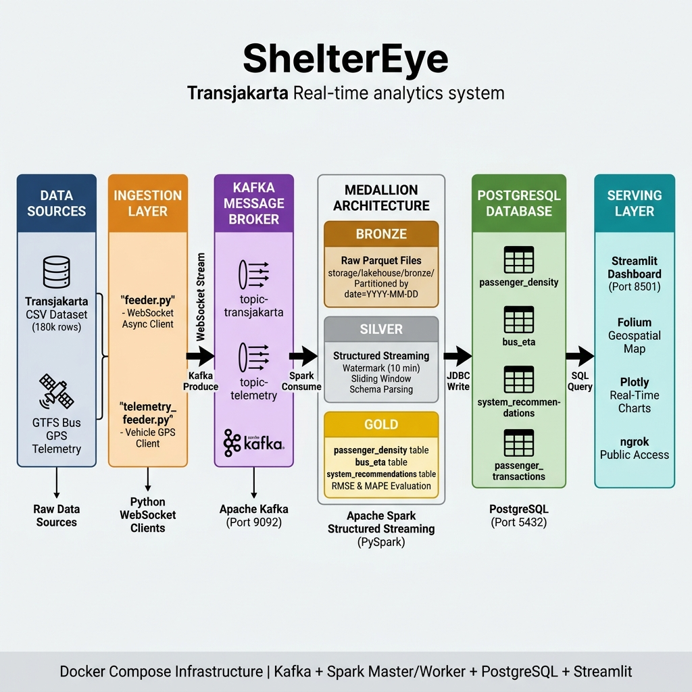
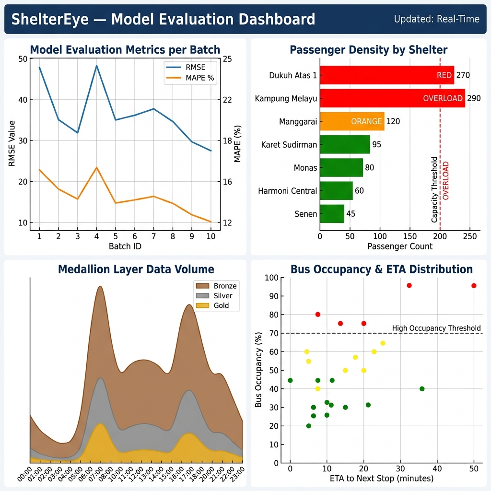

# ShelterEye — Transjakarta Real-Time Streaming Analytics & Lakehouse Pipeline

> Sistem pipeline data berskala besar (*Big Data Ecosystem*) untuk menyimulasikan, mengolah, dan memvisualisasikan data transaksi penumpang Transjakarta secara *real-time* menggunakan arsitektur modern **Data Lakehouse (Medallion Architecture)**.

---

## 🏗️ Arsitektur Sistem (End-to-End Pipeline)



### Ringkasan Komponen Pipeline

| Layer | Teknologi | Deskripsi |
| :--- | :--- | :--- |
| **Data Source** | CSV (180k rows) + GTFS GPS | Dataset historis & simulasi GPS bus real-time |
| **Ingestion** | `feeder.py`, `telemetry_feeder.py` | Python WebSocket Async Client → Kafka Producer |
| **Message Broker** | Apache Kafka (Port 9092) | Topic `topic-transjakarta` & `topic-telemetry` |
| **🟫 Bronze Layer** | Parquet on Disk | Raw data stream disimpan terpartisi per tanggal di `storage/lakehouse/bronze/` |
| **🥈 Silver Layer** | PySpark Structured Streaming | Parsing skema, watermarking (10 min), sliding window aggregasi |
| **🥇 Gold Layer** | PySpark → PostgreSQL JDBC | Prediksi AI 20 menit + kalkulasi ETA spasial → tabel siap saji |
| **Serving** | Streamlit (Port 8501) | Dashboard interaktif dengan peta Folium + Plotly charts |

---

## 📊 Evaluasi Model & Visualisasi Metrik



### Penjelasan Panel Evaluasi:

| Panel | Metrik | Keterangan |
| :--- | :--- | :--- |
| **RMSE & MAPE per Batch** | Root Mean Square Error, Mean Absolute Percentage Error | Dievaluasi otomatis setiap micro-batch Spark. Tren menurun menunjukkan akurasi prediksi meningkat seiring waktu. |
| **Kepadatan Halte Real-Time** | Passenger Count vs Kapasitas (200 orang) | Halte merah (Dukuh Atas 1 & Kampung Melayu) terdeteksi **OVERLOAD** ≥ 135% |
| **Volume Data per Medallion Layer** | Bronze > Silver > Gold | Menunjukkan pengurangan volume wajar saat data dibersihkan & diagregasi per jam |
| **Distribusi Okupansi Bus** | Occupancy % vs ETA (menit) | Scatter plot per bus aktif; titik merah = bus perlu segera dialihkan |

### Formula Evaluasi Model (per Spark Batch):
```
RMSE = √( mean( (actual_count - predicted_count)² ) )
MAPE = mean( |actual_count - predicted_count| / actual_count ) × 100%
```
> Dicetak otomatis ke terminal setiap batch di `passenger_logic.py` baris **268–289**.

---

## 📌 Informasi Dasar Sistem & Setup

1. **Database:** **PostgreSQL** sebagai *Gold Serving Layer* (Port `5432`)
2. **Message Broker:** **Apache Kafka** untuk streaming real-time (Port `9092`)
3. **Topik Kafka:** `topic-transjakarta` (transaksi) & `topic-telemetry` (GPS bus)
4. **Parquet Bronze Storage:** `storage/lakehouse/bronze/` (partisi `date=YYYY-MM-DD`)
5. **Satu feeder aktif per sesi uji:** Hanya satu orang yang menjalankan `feeder.py`
6. **Dataset:** `dfTransjakarta180kRows.csv` → letakkan di `ingestion/dataset/`

---

## 👥 Pembagian Tugas & Target Pengembangan

| Peran / Anggota | Komponen Kerja | Target Utama |
| :--- | :--- | :--- |
| **Anggota 1** | `ingestion/feeder.py` | WebSocket Async Client → Kafka Producer untuk data transaksi |
| **Anggota 2** | `processing/passenger_logic.py` | PySpark Streaming: kepadatan penumpang, AI forecasting, RMSE/MAPE eval |
| **Anggota 3** | `processing/spatial_eta_logic.py` | PySpark Streaming: analisis spasial Haversine + kalkulasi ETA armada bus |
| **Anggota 4** | `storage_dashboard/` (Backend) | Skema PostgreSQL, JDBC sink, Bronze Parquet lakehouse layer |
| **Anggota 5** | `storage_dashboard/app.py` | Streamlit dashboard: peta Folium, chart Plotly, monitoring real-time |

---

## 📂 Struktur Repositori

```text
FP-BigData-Kelompok5/
├── docs/
│   └── images/
│       ├── architecture_diagram.png     ← Diagram arsitektur sistem
│       └── evaluation_dashboard.png     ← Visualisasi metrik evaluasi
├── ingestion/
│   ├── dataset/
│   │   └── dfTransjakarta180kRows.csv   ← Masukkan manual (di-gitignore)
│   ├── feeder.py                        ← Kafka producer transaksi
│   └── telemetry_feeder.py              ← Kafka producer GPS bus
├── processing/
│   ├── historical_patterns.json         ← Profil historis untuk AI forecasting
│   ├── passenger_logic.py               ← PySpark: density, AI forecast, RMSE/MAPE
│   ├── spatial_eta_logic.py             ← PySpark: Haversine ETA, GPS tracking
│   └── checkpoints/                     ← Spark streaming state (auto-generated)
├── sim-temp/
│   ├── vehicle_server.py                ← GTFS WebSocket telemetry server
│   └── vehicle_simulator.py             ← Simulasi pergerakan armada bus
├── storage/
│   └── lakehouse/
│       └── bronze/                      ← Parquet Bronze Layer (auto-generated)
│           ├── transactions/date=.../   ← Raw transaksi partisi harian
│           └── telemetry/date=.../      ← Raw telemetry partisi harian
├── storage_dashboard/
│   └── app.py                           ← Streamlit UI dashboard
├── docker-compose.yml                   ← Infrastruktur: Kafka + Spark + PostgreSQL
└── GUIDE.md                             ← Panduan demo & rubrik penilaian
```

---

## 🚀 Panduan Memulai (Quick Start)

### 1. Clone & Sinkronisasi
```bash
git clone https://github.com/carlentray/FP-BigData-Kelompok5.git
cd FP-BigData-Kelompok5
git pull origin main
```
Letakkan file dataset `dfTransjakarta180kRows.csv` di folder `ingestion/dataset/`.

### 2. Nyalakan Infrastruktur Docker
```bash
docker compose up -d
```
Tunggu hingga container **Zookeeper, Kafka, Spark Master/Worker, PostgreSQL** berstatus `Running`.

### 3. Jalankan Simulasi GPS Bus
```bash
py -u sim-temp/vehicle_server.py
```

### 4. Jalankan Ingestion Data Transaksi
```bash
py -u ingestion/feeder.py
py -u ingestion/telemetry_feeder.py
```

### 5. Jalankan Spark Stream Processing
```bash
# Passenger Density, AI Forecasting & RMSE/MAPE Evaluation
docker exec sheltereye-spark-master /opt/spark/bin/spark-submit \
  --packages org.apache.spark:spark-sql-kafka-0-10_2.12:3.5.0,org.postgresql:postgresql:42.7.3 \
  /opt/spark/work-dir/processing/passenger_logic.py

# Spatial ETA Calculation (terminal baru)
docker exec sheltereye-spark-master /opt/spark/bin/spark-submit \
  --packages org.apache.spark:spark-sql-kafka-0-10_2.12:3.5.0,org.postgresql:postgresql:42.7.3 \
  /opt/spark/work-dir/processing/spatial_eta_logic.py
```

### 6. Jalankan Dashboard
```bash
py -m streamlit run storage_dashboard/app.py
```
Buka browser di **http://localhost:8501**

### 7. Matikan Sistem
```bash
docker compose down
```

---

## 🔍 Monitoring & Observability

| Tool | URL | Fungsi |
| :--- | :--- | :--- |
| **Streamlit Dashboard** | http://localhost:8501 | Peta real-time, chart density, log transaksi |
| **Spark Streaming UI** | http://localhost:4040 | Throughput, latency, watermark, batch stats |
| **Kafka Topics** | `docker exec -it sheltereye-kafka kafka-topics.sh --list --bootstrap-server localhost:9092` | Verifikasi topik aktif |
| **PostgreSQL Query** | `docker exec -it sheltereye-postgres psql -U admin -d db_sheltereye` | Query langsung ke Gold Layer |

---

## 📖 Referensi Rubrik & Demo
Lihat file **[GUIDE.md](GUIDE.md)** untuk:
- ✅ Panduan demo presentasi step-by-step
- ✅ Script bicara per rubrik penilaian
- ✅ Referensi baris kode yang harus ditunjukkan ke penguji
- ✅ Self-assessment keselarasan rubrik CPMK 1–4
